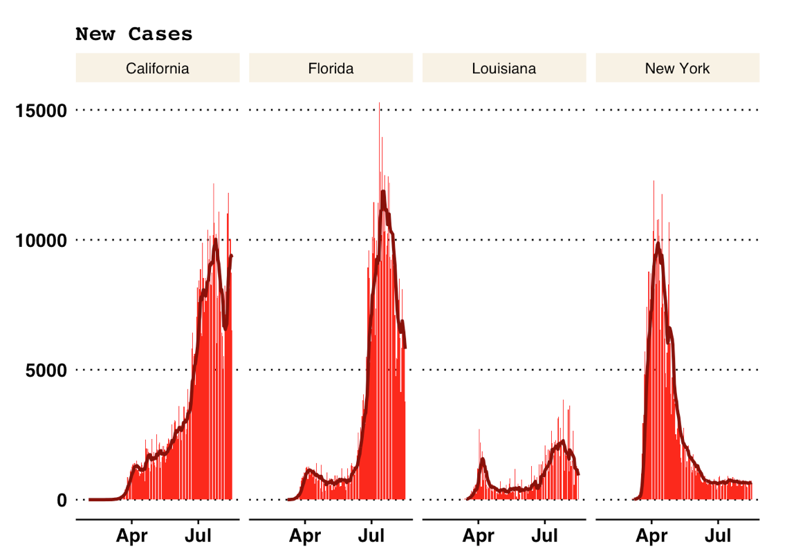
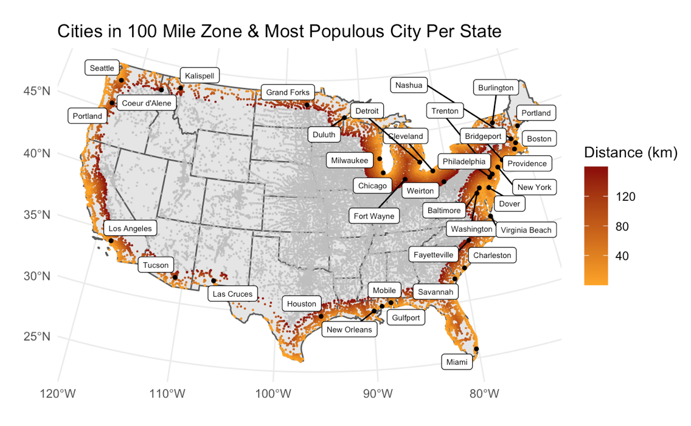
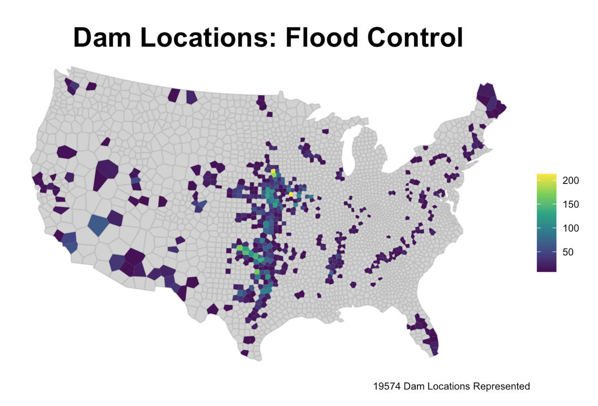
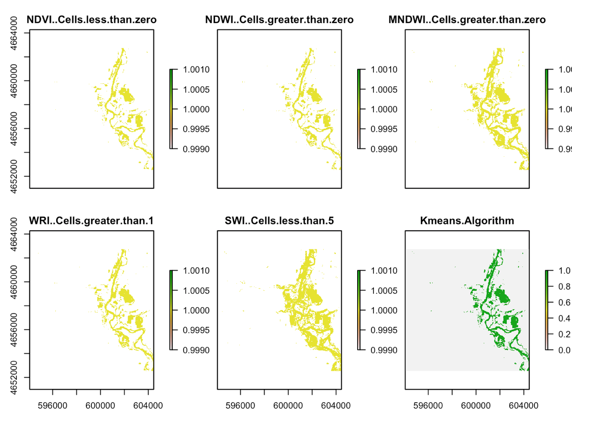

In the summer of 2020 I took a GIS course based in R. This was my first experience coding and learning about data science and it made me realize how important these skills can be in biology. Here is a collection of links! 

---

### [Building a project website](https://ewapman.github.io/)

##### In this project I:
- Learned the basics of RStudio
- Was introduced to Rmarkdown, YMAL, CSS, and HTML
- Created code to construct and personalize a website 
- Familiarized myself with Github and learned why is important for version control and publishing

---

### [Analysis of COVID-19 Data](https://ewapman.github.io/geog-176A-labs/lab-02.html)

##### In this project I:
- Learned how to use dplyr verbs to manipulate nationwide data for the COVID-19 pandemic
- Learned how to join two data sets
- Created tables and plots 
- Learned how to use lags and the rolling mean to calculate new cases and the 7 day average 

{width="50%"}

---

### [Distances and Projections](https://ewapman.github.io/geog-176A-labs/lab-03.html)

##### In this project I:
- Calculated the distances of US cities to various US borders
- Built simple feature objects from R packages and CSVs to use as spatial data 
- Manipulated map projections and geometries
- Created maps using ggplot 

{width="50%"}

---

### [Tesselations, Point-in-Polygon](https://ewapman.github.io/geog-176A-labs/lab-04.html)

##### In this project I:
- Used tessellations to analyze dam data across the United States
- Learned the importance of geometric simplification for calculations of large data sets 
- Wrote functions to simplify the coding process
- Used point-in-polygon counts on tessellation plots of the United States for visualization of dam distribution
- Made a leaflet map representing the largest, at risk, flood control dams in each state

{width="50%"}

---

### [Raster Analysis](https://ewapman.github.io/geog-176A-labs/lab-05.html)

##### In this project I:
- Learned how to work with Landsat 8 raster data to analyze flooding in a defined area of interest
- Manipulated RGB channels for Landsat imagery to emphasize features 
- Learned how to use various threshold techniques to find surface water 
- Calculated the kmeans to determine the accuracy of the binary raster layers

{width="50%"}

---

### [Flood Risk in Mission Creek: Past, Present, Future](https://ewapman.github.io/geog-176A-labs/lab-06.html)

##### In this project I:
- Used USGS water data to analyze the impact flooding on buildings near Mission Creek
- Created a hillshade raster for visualization and a HAND raster to assess flood water level
- Created a static and animated plot for visualization of the flooded area and impacted buildings

{width="30%"}

