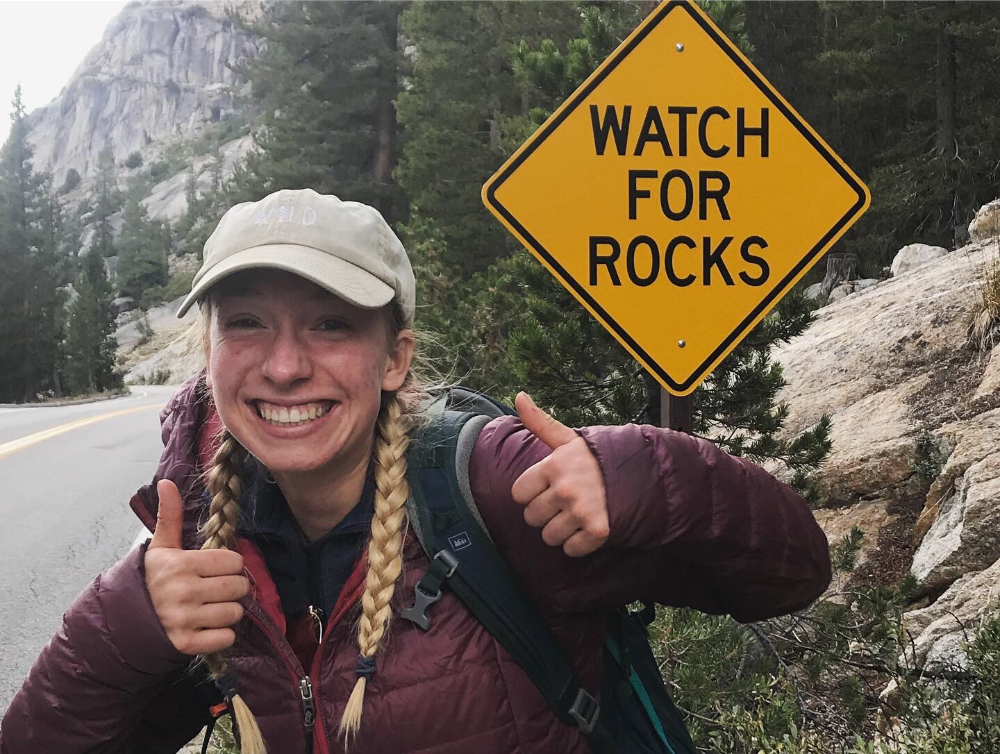

  

{width="50%"}

## Hi, I'm Emily Wapman

  
I am a third year biology major at UCSB. I am especially interested in ecology and conservation biology and hope my future career involves lots of field work and travel! I am currently interested in studying how deforestation influences the spread of zoonotic diseases within ecosystems and to human populations and how agricultural practices can be improved around the world to mitigate these issues. I decided to begin learning GIS because I know it is a very useful tool in conservation biology and hope it will help with my future research. Outside of school, I am very dedicated to the UCSB triathlon team and love doing anything active and outside! 

